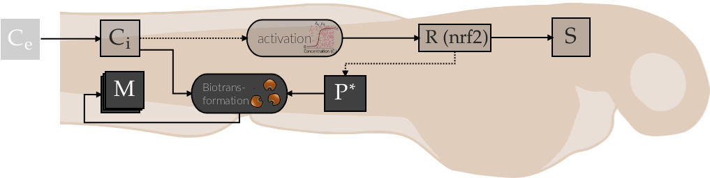

# RNA pulse TKTD model



The molecular TKTD model *TKTD-RNA-pulse* is a toxicokinetic toxicodynamic model that integrates the expression of the transcripton factor *nrf2* into the TKTD model and links it to metabolization of an exposed chemical and also to lethality. The work is a case study of experiments with zebrafish embryos, reusing data collected over 8 years at the UFZ in Leipzig, Germany. It evaluates the model exemplarily for 3 subtstances diuron, diclofenac and naproxen. The results are openly accessible under: https://pubs.acs.org/doi/10.1021/acs.est.4c06267

## Installation

**If the case study was not already installed as a submodule** with a meta package
like `tktd_nrf2_zfe`, you can install the package as follows.

Open a command line utility (cmd, bash, ...) and execute

```bash
git clone git@github.com:flo-schu/tktd_rna_pulse/0.2.7
cd tktd_rna_pulse
```

Create environment, activate it and install model package. 
```bash
conda create -n tktd_rna_pulse python=3.11
conda activate tktd_rna_pulse
pip install -e .
```

### Optionally download and track datasets with datalad

download the existing results datasets and unlock the results dataset to be
able to re-compute results. If you mess anything up, just delete the whole dataset
and download again. (you may have to install datalad: https://handbook.datalad.org/en/latest/intro/installation.html)

```bash
datalad clone git@gin.g-node.org:/flo-schu/tktd_nrf2_zfe__data.git data
datalad clone git@gin.g-node.org:/flo-schu/tktd_rna_pulse__results.git results
datalad unlock case_studies/tktd_rna_pulse/results
cd data && git annex get
```

if this is not possible create a new dataset with `datalad create -c text2git results` (see section below)

### testing if everything worked

The case studies should now be ready to use. Test by executing 

`pymob-infer --help`


## Usage

### Interactive jupyter notebooks 

The preferred files to get started with are in the case_studies directory

- case_studies/tktd_rna_pulse/scripts/tktd_rna_3_6c_substance_specific.ipynb
- case_studies/tktd_rna_pulse/scripts/tktd_rna_3_6c_substance_independent.ipynb

Open and interact these files with your preferred development environment. If you
don't have any: `pip install jupyterlab` inside the console with the activated
(conda) environment, navigate to the notebooks and run the notebooks.

### Command line

there is a command line script provided by the `pymob` package which will directly
run inference accroding to the scenario settings.cfg file provided in the scenario
folder of the respective case study. For details see https://pymob.readthedocs.io/en/latest/case_studies.html

`pymob-infer --case_study tktd_rna_pulse --scenario rna_pulse_5_substance_independent_rna_protein_module --package=.. --inference_backend numpyro`

The results will be stored in the results directory of the respective case study 
unless otherwise specified in the settings.cfg


## Tracking results and data with datalad and gin

1. create a new `results` dataset in the root of the repository

`datalad create -c text2git results`

if the directory already exists, use the `-f` flag:

`datalad create -f -c text2git results`

2. save the results as they come in in order to keep a version history.

`datalad save -m "Computed posterior with nuts"`


### Upload the dataset to gin.

The following only works if you're a contributor on the g-node repository 

1. Create a new repository on gin https://gin.g-node.org/

2. add the repository as a remote for the dataset

`datalad siblings add -d . --name gin --url git@gin.g-node.org:/flo-schu/tktd_rna_pulse__results.git`

The remote is now connected to the sibling `gin`. 

3. Push new results to gin `datalad push --to gin` 
